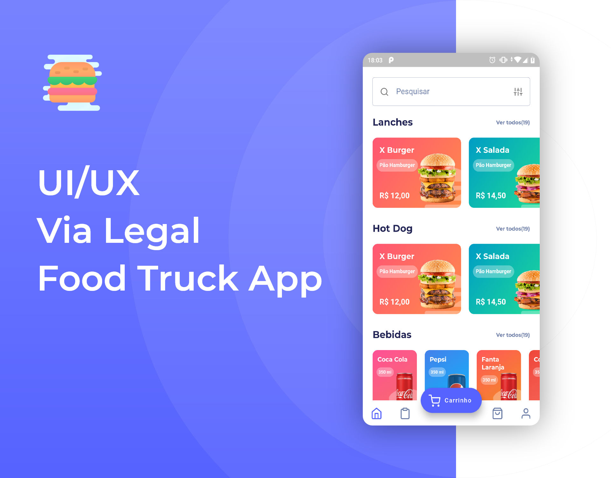
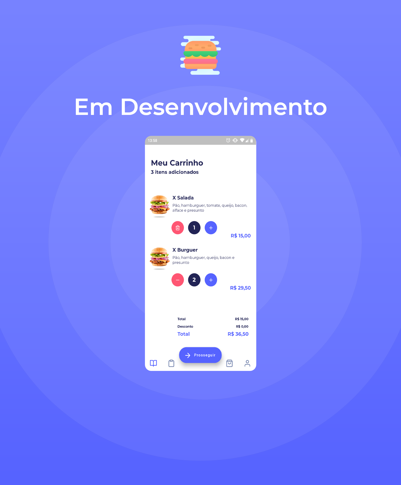

# Aplicativo Via Legal Food Truck - Em Desenvolvimento

Aplicativo criado para a empresa Via Legal situada em Mogi Mirim, que tem por finalidade facilitar a encomenda de Lanches, Hot Dog, Bebidas e outros para delivery ou retira.

## Ferramentas Utilizadas neste projeto até o momento:

### Linguagens:
- Dart

### Frameworks:
- Flutter

### Bancos de Dados:
- Firebase Firestore

### Outras Ferramentas:
- Firebase Storage

### Ferramentas Design da Interface:
- Adobe XD
- Adobe Photoshop

### Dependências:
- Firebase Auth
- Firebase Cloud Firestore
- Firebase Core
- Line Awesome Icons
- Flutter Feather Icons
- Badges

### Plataformas:
- Android
- iOS

### Informações de Construção Android:
- Minimum Sdk Version: 16
- Target Sdk Version: 28

### Informações de Construção iOS:
- Em desenvolvimento para publicação

### URL Google Play Store:
- Em desenvolvimento para publicação

### URL Apple Store:
- Em desenvolvimento para publicação

 
